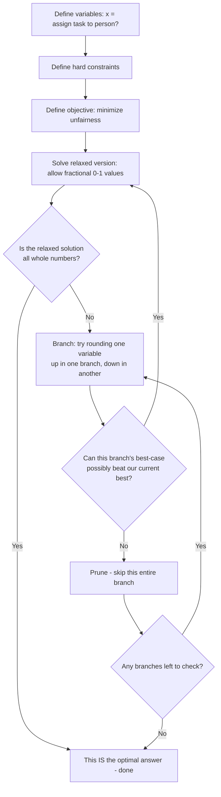
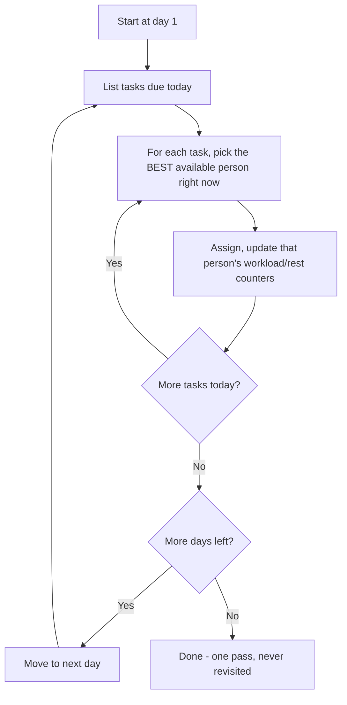
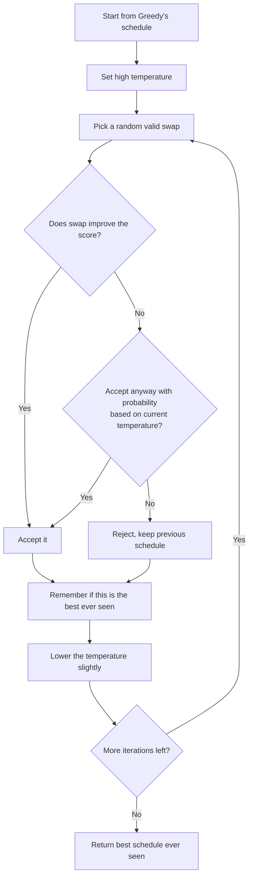
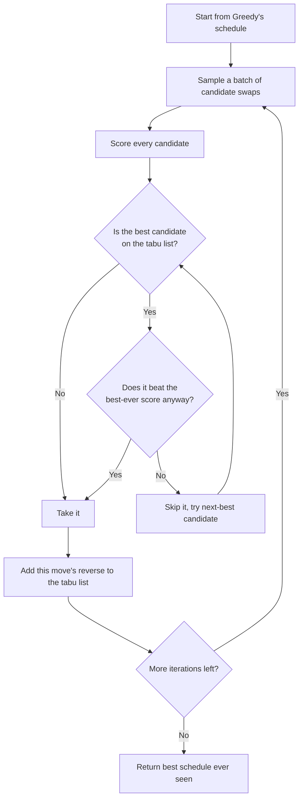
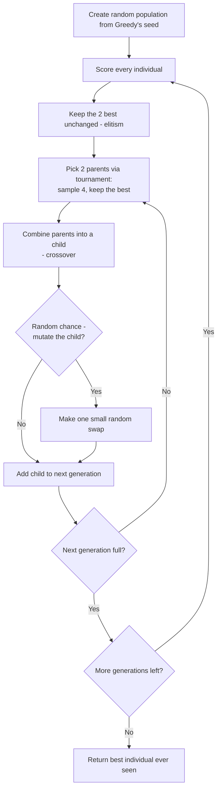
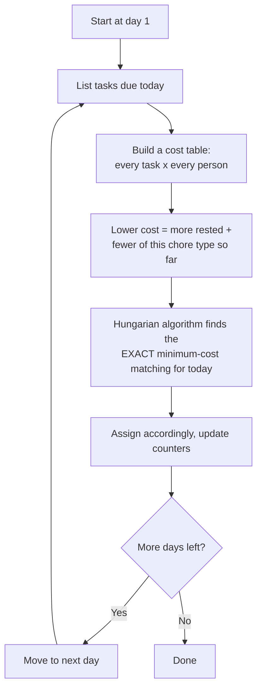
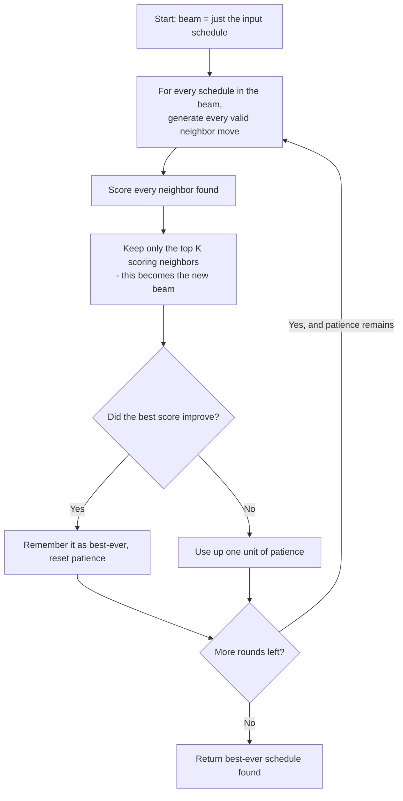

# Chore Scheduler

An automated household chore scheduler that assigns *who* does *what* on
*which day*, while respecting rest requirements, chore frequencies, days
off, and fairness — solved and cross-checked by **six different
algorithms**, so you can see the tradeoffs instead of trusting a black box.

```
config.yml  --->  optimizer.py  --->  scheduler.py  --->  main.py
(rules)          (6 algorithms)      (reporting/export)   (orchestration)
```

This document explains **each algorithm**: the general concept first, then
exactly how it was shaped to fit this specific scheduling problem. The goal
is that you could take any one of these algorithms and recognize it in a
completely different context (routing, resource allocation, timetabling) —
not just know it worked here.

---

## 1. The problem, in one paragraph

Every day, some chores are "due" (dishes daily, sweeping every 3 days,
stove-cleaning every 10 days, and mopping riding along on every 2nd sweep
day). Five people need to split these tasks so that: no one works two
chores the same day, no one is assigned on their day off, no one gets less
rest between tasks than the buffer requires, and the workload — both total
tasks and each specific chore type — is spread evenly. On top of that, the
schedule should ideally **continue smoothly** from the previous month
instead of resetting every time.

That combination — hard scheduling rules *plus* multiple competing
fairness goals *plus* state that persists across runs — is what makes this
a genuinely interesting testbed for comparing algorithms, rather than a toy
problem with one obvious answer.

---

## 2. Algorithm 1 — MILP (Mixed-Integer Linear Programming)

### The concept

MILP is how you solve a problem *exactly*, with a mathematical proof that
no better answer exists — without checking every possible answer one by
one (which would take longer than the universe has existed, even for
small problems like this one).

You describe the problem as: some yes/no decisions (**variables**), rules
those decisions must obey (**constraints**), and a number you want as
small or large as possible (**objective**). A solver called **branch and
bound** then explores the space of decisions intelligently: it relaxes the
"yes/no" restriction to "anywhere from 0 to 1", solves that easier version
instantly, and uses the result as a mathematical *proof* that whole
branches of possibilities can't contain a better answer than what's
already been found — so it skips them entirely without ever looking
inside.



### How it fit this use case

- **Variables**: `x[slot, person]` = 1 if this person does this task on
  this day. `y[chore_group, day]` = 1 if a chore fires on this day at all
  (since chores like "every 3 days" don't have a fixed day — the solver
  picks it).
- **Hard constraints**: each chore fires exactly once per its frequency
  window; a person works at most one task per day; days off are never
  violated; a "piggyback" chore (Mop) lands on the exact day its host
  chore (Sweep/Trash) was assigned, every Nth time.
- **Soft constraints** (minimized, not forbidden): the rest buffer between
  tasks, and cadence (how evenly spaced occurrences are) — both solved in
  two phases: first minimize *how many* rules must bend, then, having
  locked that minimum in, optimize fairness among all schedules that
  achieve it. This avoids a single blended objective with wildly different
  weight scales, which is a classic way to make a solver numerically
  unstable.
- **Result**: the only one of the six algorithms with a genuine
  optimality *guarantee* — when it says "2 unavoidable exceptions", that's
  proven to be the true minimum, not just the best it happened to find.

---

## 3. Algorithm 2 — Greedy Heuristic

### The concept

Greedy makes the single best-looking choice at each step and never looks
back. It's the fastest possible approach and often surprisingly good, but
it has no way to know that a slightly worse choice now might have opened
up a much better path later — it can walk itself into a corner.



### How it fit this use case

- "Best available person" = ranked by: most rested first, then fewest of
  *this specific chore type* so far, then fewest tasks overall — in that
  order, so it doesn't just balance totals while quietly dumping every
  Stove shift on one person.
- Also decides **when** a variable-frequency chore fires: it waits for a
  day where a well-rested person is available, but is forced to fire on
  the last possible day of its window if it's been waiting too long.
- Used as the **starting point** ("seed") for three of the other five
  algorithms — Simulated Annealing, Tabu Search, and the Genetic
  Algorithm all begin from Greedy's output and improve on it, rather than
  starting from nothing.

---

## 4. Algorithm 3 — Simulated Annealing

### The concept

Named after annealing metal: heat it up so atoms move around freely, then
cool it down slowly so they settle into a stable, low-energy structure.
Applied to search: start "hot" (willing to accept moves that make things
*worse*, to escape bad local traps), then gradually "cool" (become pickier,
until eventually it only accepts improving moves, like greedy would).



### How it fit this use case

- A "move" = swap which person is assigned to two different task-slots
  (checked for validity: no days-off violation, no double-booking the same
  day for either person).
- Temperature starts high (`T0 = 5.0`) and decays smoothly to near-zero
  over 8,000 iterations, so early on it can escape whatever local trap
  Greedy left it in, and late on it behaves like careful hill-climbing.
- Score = fairness spread + per-chore spread + buffer violations, all in
  one number — lower is better, and a worse intermediate move is only ever
  *kept* if the temperature roll allows it; the best-ever schedule is
  always what gets returned, regardless of where the walk ends up.

---

## 5. Algorithm 4 — Tabu Search

### The concept

Like Simulated Annealing, Tabu Search also improves on a starting
schedule through small moves — but instead of occasionally accepting a
random worse move, it **always takes the single best move available**,
and instead prevents getting stuck oscillating between the same two
states by keeping a short memory ("tabu list") of recently-reversed moves
that are temporarily forbidden — forcing it to explore new territory
instead of undoing its own last step.



### How it fit this use case

- Same swap-move definition and scoring function as Simulated Annealing —
  the *only* difference is the acceptance rule, which is exactly what
  makes this a clean side-by-side comparison of "sometimes accept worse"
  vs. "always take the best, but remember where you've been".
- Tabu tenure = 15 iterations (a move stays forbidden for 15 rounds after
  being made), with an **aspiration criterion**: a tabu move is still
  taken if it would beat the best schedule found so far — the memory
  shouldn't block a genuinely good discovery.

---

## 6. Algorithm 5 — Genetic Algorithm

### The concept

Modeled on evolution: keep a whole **population** of candidate solutions
at once (not just one), let the best ones "reproduce" by combining pieces
of two parent solutions (**crossover**), occasionally introduce small
random changes (**mutation**), and repeat over many **generations** —
weaker candidates die out, stronger traits persist and recombine.



### How it fit this use case

- Population of 30 candidate schedules, evolved over 150 generations.
- **Crossover**: for each task-slot, the child randomly inherits either
  parent's assignment, then repairs any conflict (same-day double-booking,
  days-off violation) by falling back to a valid swap.
- **Tournament selection**: pick 4 random individuals, keep the fittest —
  repeated to choose each parent, giving good solutions a better chance to
  reproduce without completely ignoring diversity.
- **Elitism**: the top 2 individuals always survive unchanged into the
  next generation, so the population's best-ever score can never
  regress.

---

## 7. Algorithm 6 — Daily Hungarian Assignment

### The concept

The **assignment problem** — matching N things to N things at minimum
total cost — has an exact, efficient solution: the **Hungarian algorithm**
(also called Kuhn–Munkres), which finds the *provably optimal* one-to-one
matching, not just a good one, in a fraction of a second.



### How it fit this use case

- Same day-by-day structure as Greedy (deciding *when* variable-frequency
  chores fire the same way), but the *person* assignment for each day is
  solved as an **exact bipartite matching** across all of that day's tasks
  simultaneously — via `scipy.optimize.linear_sum_assignment` — instead of
  Greedy's one-task-at-a-time picks.
- This can find a better *joint* assignment on days with multiple
  simultaneous tasks (e.g. Mop + Sweep/Trash the same day) that a
  one-at-a-time greedy pick might miss.
- Explicitly rebuilt to understand the Mop/Sweep piggyback relationship
  (tracking each chore's occurrence count so it knows exactly when the
  "every 2nd time" rule fires) — Greedy/SA/Tabu/GA do not have this,
  since they only approximate piggyback groups as independent chores.

---

## 8. The Rest-Polish Layer (Beam Search)

### The concept

After any algorithm above produces a schedule, this is a **finishing-touch
repair pass** — not a 7th competing algorithm, but a step applied to
*every* algorithm's output. It specifically targets rest-gap problems that
the main algorithm may not have prioritized.

Pure greedy repair (try every move, take the single best one, repeat) can
get stuck: a move that looks slightly worse right now might be exactly
what was needed to unlock a much better state next round, but greedy would
never take it. **Beam search** fixes this by keeping the **top-K**
candidate states each round — not just one — expanding all of them, then
pruning back down. True brute-force (trying every possible combination)
is computationally impossible at this scale; beam search is the
tractable middle ground.



### How it fit this use case

- **Two move types**: person-swap (change *who*, never *when*) and
  day-shift (move a whole chore occurrence to a nearby day, but *only*
  within that chore's own configured `tolerance_days` — this is the only
  place tolerance has any effect; the main algorithms above always target
  the exact day).
- **Safety-gated**: no move is ever accepted if it would increase
  structural violations (frequency, cadence, piggyback, days-off) or make
  fairness *worse* than the schedule this pass started from. This pass
  fixes rest, it doesn't get to trade away correctness or fairness to do
  it.
- Beam width 6, up to 60 rounds, stopping early after 10 rounds with no
  improvement — broad enough to escape greedy traps, bounded enough to
  stay fast.

---

## 9. Picking a winner

All six algorithms' outputs (after polishing) are ranked by, in order:

1. **Structural violations** (frequency / cadence / piggyback / days-off)
   — non-negotiable. A schedule that breaks these is *wrong*, regardless
   of how good its other numbers look.
2. **Buffer violations** — how many times the rest requirement had to
   bend.
3. **Rest-balance spread** — how far apart the *least* and *most* rested
   person's average rest is. (This used to be completely missing from
   the ranking — a schedule could win by tying on violations and winning
   a later tiebreaker that had nothing to do with actual rest fairness.)
4. **Per-chore fairness spread** — does everyone get a fair share of
   *each* chore type, not just a fair total count.
5. **Overall fairness spread** — total task count balance.

You can also interactively switch between any of the six schedules before
committing to one — the ranking is a recommendation, not a lock-in.

---

## 10. Continuity across runs

A `schedule_state.json` file persists three things between runs, so a new
month doesn't reset everything to zero:

- **Rest owed**: if someone's last task was recent, their early days in
  the new run inherit that debt (as a *soft* constraint — never a hard
  block that could make the whole schedule impossible).
- **Chore phase**: a chore's frequency cycle continues from where it left
  off (e.g. if Sweep/Trash last happened 2 days before the new run
  started, its first occurrence window shrinks accordingly) instead of
  restarting the clock.
- **Cumulative fairness**: total task counts and per-chore counts carry
  forward, so fairness is judged across the *whole history*, not just
  this one run in isolation.

If MILP goes infeasible on a continuation run, `diagnose_milp_infeasibility`
automatically re-solves with each of these three carry-overs isolated, to
tell you exactly which one is responsible — instead of just failing
silently.

---

## 11. Validation

Every winning schedule is independently re-checked from scratch — not
trusted just because a solver said "optimal":

- Each chore fires exactly once per its frequency window.
- Consecutive occurrences stay close to the target frequency (cadence),
  within any configured tolerance.
- Piggyback chores land within tolerance of their host's actual chosen
  day, specifically on every Nth occurrence.
- Nobody is ever assigned on a day off.

This is the same class of check a human would do by hand — re-derived
independently, not just reading back the solver's own internal state.

---

## File structure

| File | Contains |
|---|---|
| `config.yml` | Roommates, chore frequencies/tolerances, buffer days, days off, planning window |
| `optimizer.py` | All 6 algorithms, shared scoring/validity helpers, the polish layer |
| `scheduler.py` | Config/state I/O, calendar, human-readable reporting, validation, CSV/DOCX/PDF export |
| `main.py` | Orchestration only — run this: `python main.py` |
| `schedule_state.json` | Auto-generated after each run, enables continuity into the next one |