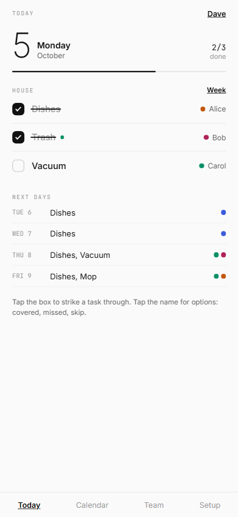
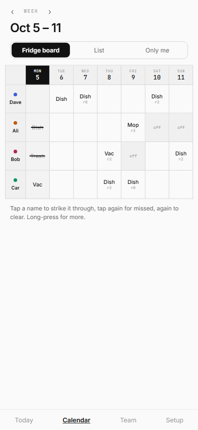
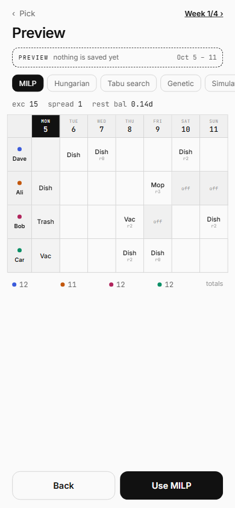
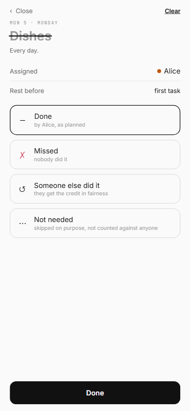
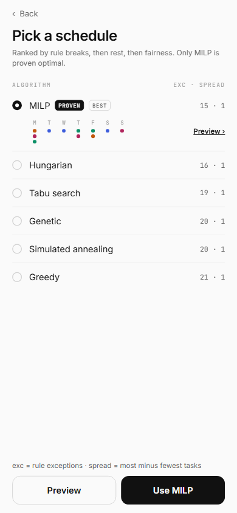
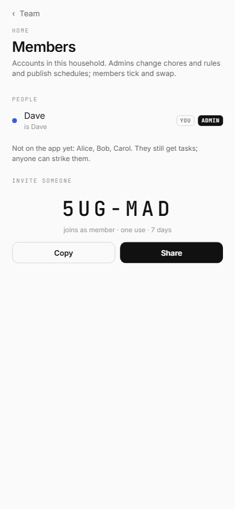
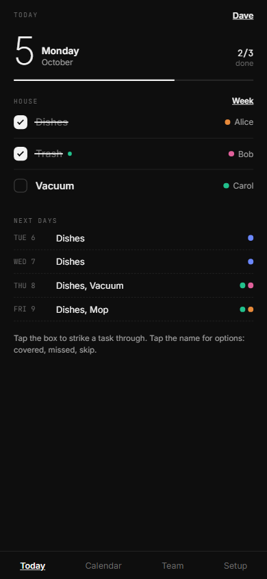
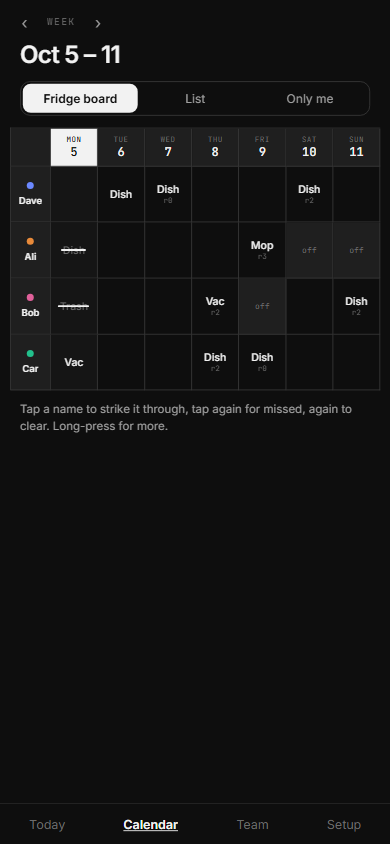

# Chores

**Fair chores for shared homes.**

Chores plans who does what each day, so nobody carries the house. Add your
roommates and chores, mark days off and who never does what, and get a fair
schedule for the next few weeks. Everyone sees it on their phone and strikes a
chore through when it's done, like the paper on the fridge, only shared.

- **Fair by default:** work is split evenly, with rest days between turns
- **Fits real life:** days off, chores someone never does, chores that go together (mop every second vacuum)
- **Shared:** invite roommates with a code; admins set the rules, everyone ticks off
- **Fridge board:** a person-by-day grid you strike through, right on your phone

<table>
  <tr>
    <td></td>
    <td></td>
    <td></td>
    <td></td>
  </tr>
  <tr>
    <td align="center">Today</td><td align="center">Fridge board</td><td align="center">Preview before publishing</td><td align="center">Done, missed, covered</td>
  </tr>
  <tr>
    <td></td>
    <td></td>
    <td></td>
    <td></td>
  </tr>
  <tr>
    <td align="center">Pick a plan</td><td align="center">Invite with a code</td><td align="center">Dark mode</td><td align="center">Dark mode</td>
  </tr>
</table>

More in [docs/screenshots](docs/screenshots/).

Under the hood a scheduling engine compares several solvers and suggests the
best plan; you can preview the others before choosing. How it works:
[docs/algorithms.md](docs/algorithms.md).

## What's in this repo

| Path | What it is |
|---|---|
| [`app/`](app/) | The iOS and Android app (Expo / React Native) |
| [`server/`](server/) | The API the app talks to: accounts, households, planning, statuses |
| [`optimizer.py`](optimizer.py), [`scheduler.py`](scheduler.py) | The scheduling engine |
| [`main.py`](main.py) | The original command-line version |
| [`mockup/`](mockup/) | HTML design mockups: the full screen flow in the minimal-mono style, light and dark |
| [`docs/algorithms.md`](docs/algorithms.md) | How the scheduling engine works |

## Quick start

### The app

Two terminals, from the repo root.

```sh
# 1 - server
pip install -r server/requirements.txt
python -m uvicorn server.main:app --host 0.0.0.0 --port 8000

# 2 - app
cd app
npm install
npx expo start
```

Scan the QR code with **Expo Go**. Your phone and computer need the same Wi-Fi,
and on a physical iPhone Expo Go and Expo CLI must be signed in to the same Expo
account (`npx expo login`). Details and troubleshooting are in
[app/README.md](app/README.md).

> On Windows with the Microsoft Store Python, use `python -m uvicorn`. Plain `uvicorn` fails with "Access is denied".

### The command-line version

```sh
pip install -r requirements.txt
cp config_example.yml config.yml      # then edit roommates, chores, days off
python main.py
```

It prints the plan and exports it to CSV, Word or PDF. Each run continues from the
last one, so rest and fairness carry over month to month.

### Sign-in options

| Method | Works in | Needs |
|---|---|---|
| Email + password | everywhere | nothing |
| Sign in with Apple | iOS, including Expo Go | an Apple Developer membership for store builds |
| Google | development / store builds | a Google Cloud OAuth client, plus `EXPO_PUBLIC_GOOGLE_WEB_CLIENT_ID`, `EXPO_PUBLIC_GOOGLE_IOS_CLIENT_ID` (app) and `GOOGLE_CLIENT_IDS` (server) |

The Google button only appears once both the app build and the server are
configured for it.

## Tests and checks

```sh
python -m pytest -c server/pytest.ini --rootdir=server server/tests   # API, auth, sign-in, full solve loop
cd app && npx tsc --noEmit && npx expo lint                           # app types + lint
```

## Roadmap

| Phase | Scope | Status |
|---|---|---|
| 1 | App core: onboarding, planning with preview, Today, fridge board with strikethrough, Setup | done |
| 2a | Accounts, separate households, invite codes, admin / member roles, account deletion | done |
| 2b | Sign in with Apple and Google | done; Google turns on once a Google Cloud client is set up |
| 2c | Requests (day off, swap) with admin preview and approval, push notifications, hosted server | next |
| 3 | Solo mode (balance load across days), chores done several times a day, customisation | planned |
| 4 | Home and lock-screen widgets, Live Activities, kitchen-tablet fridge board, App Store release | planned |

## Privacy

`config.yml`, `schedule_state.json`, generated exports and `server/data/` are
gitignored. The examples in this repo use sample names only.
